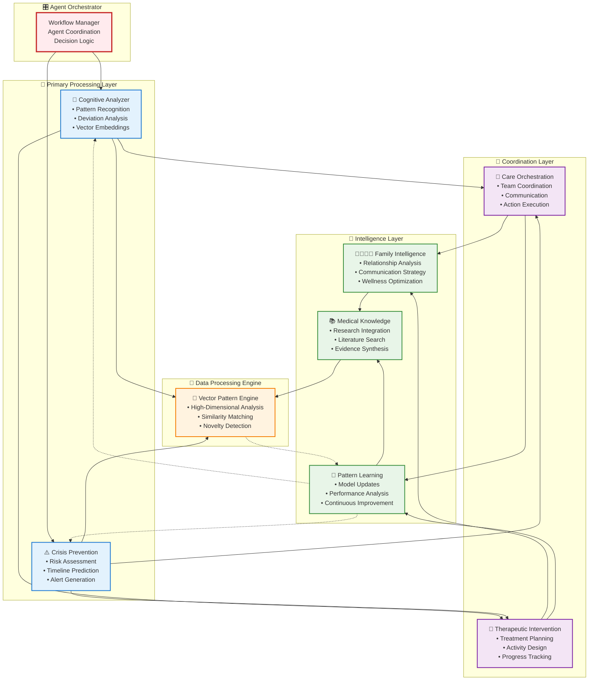
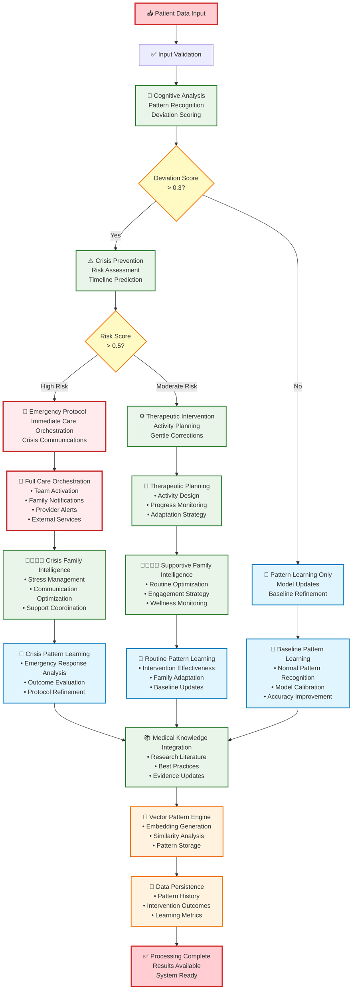

# SynapseGuard Architecture Documentation

## 🏗️ **System Architecture Overview**

SynapseGuard implements a sophisticated **Multi-Agent AI Architecture** designed for neurodegenerative healthcare management. The system leverages **7 specialized AI agents** working in coordinated workflows to provide comprehensive patient care analysis, crisis prevention, and family coordination.

## 🎭 **Multi-Agent Orchestration Design**

### **Agent Hierarchy & Coordination**


### **Agent Execution Flow**


### **TiDB Vector Search Integration**
```mermaid
graph LR
    subgraph "🧬 Behavioral Input"
        BI[Patient Behavior<br/>• Daily Routines<br/>• Cognitive Metrics<br/>• Physical Patterns]
    end
    
    subgraph "🧮 Vector Processing"
        EMB[Text Embedding<br/>OpenAI Embeddings<br/>512-dimensional vectors]
        
        NORM[Vector Normalization<br/>L2 Normalization<br/>Similarity Optimization]
    end
    
    subgraph "💾 TiDB Serverless"
        VEC_STORE[Vector Storage<br/>VECTOR(512) column<br/>Indexed for Performance]
        
        VEC_SEARCH[Similarity Search<br/>VEC_COSINE_DISTANCE()<br/>Pattern Matching]
        
        META_DATA[Metadata Storage<br/>JSON patterns<br/>Timestamps & Scores]
    end
    
    subgraph "🔍 Analysis Engine"
        SIM[Similarity Analysis<br/>Cosine Distance<br/>Top-K Retrieval]
        
        CLUSTER[Pattern Clustering<br/>Similar Behavior Groups<br/>Deviation Classification]
        
        PREDICT[Outcome Prediction<br/>Historical Effectiveness<br/>Intervention Success]
    end
    
    BI --> EMB
    EMB --> NORM
    NORM --> VEC_STORE
    
    VEC_STORE --> VEC_SEARCH
    VEC_SEARCH --> SIM
    
    VEC_STORE -.-> META_DATA
    META_DATA -.-> SIM
    
    SIM --> CLUSTER
    SIM --> PREDICT
    
    CLUSTER --> RESULTS[🎯 Pattern Insights<br/>• Similar Cases<br/>• Risk Factors<br/>• Intervention Recommendations]
    
    PREDICT --> RESULTS
    
    %% Styling
    classDef input fill:#e3f2fd,stroke:#1976d2,stroke-width:2px
    classDef processing fill:#f1f8e9,stroke:#388e3c,stroke-width:2px
    classDef database fill:#fff3e0,stroke:#f57c00,stroke-width:2px
    classDef analysis fill:#f3e5f5,stroke:#7b1fa2,stroke-width:2px
    classDef output fill:#ffebee,stroke:#c62828,stroke-width:2px
    
    class BI input
    class EMB,NORM processing
    class VEC_STORE,VEC_SEARCH,META_DATA database
    class SIM,CLUSTER,PREDICT analysis
    class RESULTS output
```

## 🤖 **Agent Specifications**

### **1. Cognitive Analyzer Agent** (`cognitive_analyzer.py`)
**Purpose**: Primary behavioral pattern analysis and deviation detection

**Core Functions**:
- **Pattern Embedding**: Converts behavioral data to 512-dimensional vectors
- **Vector Similarity**: Uses TiDB `VEC_COSINE_DISTANCE()` for pattern matching
- **Deviation Scoring**: Quantifies behavioral changes (0.0-1.0 scale)
- **Trajectory Prediction**: AI-powered cognitive decline forecasting

**Database Interactions**:
```sql
-- Pattern storage with vector embeddings
INSERT INTO behavioral_patterns (pattern_vector, deviation_score, ...)
-- Historical similarity search
SELECT * FROM behavioral_patterns ORDER BY VEC_COSINE_DISTANCE(pattern_vector, %s)
```

**Key Algorithms**:
- Cosine similarity for pattern matching
- Moving average deviation calculation
- Linear regression for trend prediction

### **2. Crisis Prevention Agent** (`crisis_prevention.py`)
**Purpose**: Risk assessment and crisis prediction

**Core Functions**:
- **Risk Scoring**: Multi-factor risk assessment algorithm
- **Crisis Classification**: Identifies crisis types (wandering, falls, confusion)
- **Time Horizon Prediction**: Estimates crisis timing (hours/days/weeks)
- **Action Recommendation**: Generates intervention priorities

**Decision Logic**:
```python
if deviation_score > 0.7 and trend_slope > 0.05:
    risk_score = calculate_composite_risk(
        behavioral_factors, 
        historical_patterns, 
        environmental_context
    )
    if risk_score > 0.8:
        activate_emergency_protocols()
```

### **3. Care Orchestration Agent** (`care_orchestration.py`)
**Purpose**: Multi-stakeholder coordination and action execution

**Core Functions**:
- **Team Coordination**: Synchronizes care team activities
- **Communication Management**: Manages family, provider, caregiver messaging
- **Action Execution**: Triggers external service integrations
- **Protocol Activation**: Initiates emergency response procedures

**External Integrations**:
- Twilio SMS for crisis alerts
- SendGrid email for care updates  
- Calendar API for appointment scheduling
- Healthcare provider EHR systems

### **4. Therapeutic Intervention Agent** (`therapeutic_intervention.py`)
**Purpose**: Personalized treatment and activity recommendations

**Core Functions**:
- **Activity Design**: Creates personalized therapeutic activities
- **Progress Tracking**: Monitors intervention effectiveness
- **Adaptation**: Adjusts interventions based on outcomes
- **Evidence Integration**: Uses medical literature for recommendations

**Intervention Categories**:
- Cognitive stimulation exercises
- Physical activity programs
- Social engagement activities
- Environmental modifications

### **5. Family Intelligence Agent** (`family_intelligence.py`)
**Purpose**: Family dynamics optimization and communication strategy

**Core Functions**:
- **Relationship Analysis**: Models family interaction patterns
- **Communication Optimization**: Tailors messages for different family roles
- **Wellness Scoring**: Tracks family caregiver stress and wellbeing
- **Strategy Recommendation**: Suggests family coordination approaches

**Family Modeling**:
```json
{
  "family_structure": {
    "primary_caregiver": { "stress_level": 0.6, "availability": 0.8 },
    "secondary_caregivers": [...],
    "support_network": [...]
  },
  "communication_preferences": {
    "frequency": "daily|weekly",
    "channels": ["sms", "email", "phone"],
    "detail_level": "brief|detailed"
  }
}
```

### **6. Pattern Learning Agent** (`pattern_learning.py`)
**Purpose**: Continuous model improvement and adaptation

**Core Functions**:
- **Model Performance Tracking**: Monitors agent effectiveness
- **Parameter Optimization**: Adjusts agent configurations
- **Outcome Learning**: Incorporates intervention results
- **Population Learning**: Learns from cross-patient patterns

**Learning Metrics**:
- Prediction accuracy rates
- Intervention success rates  
- False positive/negative rates
- User satisfaction scores

### **7. Medical Knowledge Agent** (`medical_knowledge_agent.py`)
**Purpose**: Medical literature integration and evidence-based recommendations

**Core Functions**:
- **Literature Search**: Queries medical research database
- **Evidence Synthesis**: Combines multiple research sources
- **Recommendation Generation**: Creates evidence-based suggestions
- **Knowledge Updates**: Incorporates latest medical research

**Knowledge Integration**:
```sql
-- Full-text search across medical literature
SELECT * FROM medical_knowledge 
WHERE MATCH(content, keywords) AGAINST('%alzheimer care intervention%')
ORDER BY relevance_score DESC
```

### **8. Vector Pattern Engine** (`vector_pattern_engine.py`)
**Purpose**: Advanced vector-based pattern analysis and matching

**Core Functions**:
- **High-Dimensional Analysis**: 512-dimensional behavioral vectors
- **Similarity Clustering**: Groups similar behavioral patterns
- **Outcome Prediction**: Predicts intervention effectiveness
- **Novelty Detection**: Identifies unprecedented behavioral patterns

## 🗄️ **Database Architecture**

### **TiDB Serverless Schema Design**

#### **Core Tables**
```sql
-- Patient master data with JSON flexibility
CREATE TABLE patients (
    patient_id VARCHAR(50) PRIMARY KEY,
    name VARCHAR(100),
    diagnosis VARCHAR(100),
    baseline_patterns JSON,        -- Flexible patient data
    family_contacts JSON,          -- Dynamic family structure
    created_at DATETIME DEFAULT CURRENT_TIMESTAMP
);

-- Vector-enabled behavioral pattern storage
CREATE TABLE behavioral_patterns (
    pattern_id VARCHAR(50) PRIMARY KEY,
    patient_id VARCHAR(50),
    pattern_vector VECTOR(512),    -- High-dimensional embeddings
    raw_data JSON,                 -- Original behavioral data
    deviation_score FLOAT,         -- Quantified deviation
    pattern_type ENUM('routine', 'cognitive', 'physical', 'social'),
    timestamp DATETIME,
    INDEX idx_vector_search (patient_id),
    FOREIGN KEY (patient_id) REFERENCES patients(patient_id)
);

-- Intervention history and outcomes
CREATE TABLE interventions (
    intervention_id VARCHAR(50) PRIMARY KEY,
    patient_id VARCHAR(50),
    agent_type VARCHAR(50),         -- Which agent created intervention
    effectiveness_score FLOAT,     -- Measured outcome success
    external_actions JSON,         -- External service calls made
    timestamp DATETIME,
    FOREIGN KEY (patient_id) REFERENCES patients(patient_id)
);
```

#### **Advanced TiDB Features Utilized**

**1. Vector Search**
```sql
-- Find behaviorally similar patterns
SELECT *, VEC_COSINE_DISTANCE(pattern_vector, %s) as distance
FROM behavioral_patterns
ORDER BY distance ASC
LIMIT 10;
```

**2. JSON Processing**
```sql
-- Query flexible patient data
SELECT patient_id, 
       JSON_EXTRACT(baseline_patterns, '$.daily_routine.wake_time') as wake_time,
       JSON_EXTRACT(family_contacts, '$.primary_caregiver.name') as caregiver
FROM patients;
```

**3. Full-text Search**
```sql
-- Medical knowledge retrieval
SELECT * FROM medical_knowledge
WHERE MATCH(content, keywords) AGAINST('alzheimer intervention' IN NATURAL LANGUAGE MODE)
ORDER BY relevance_score DESC;
```

## 🔄 **Data Flow Architecture**

### **Multi-Step Processing Pipeline**
```
Input Data → Preprocessing → Agent Processing → Decision Logic → Action Execution → Learning
     │             │              │                │              │              │
     ▼             ▼              ▼                ▼              ▼              ▼
Sensor Data   Validation    Cognitive Analysis  Risk Assessment  External APIs  Model Updates
Patient Info  Normalization Crisis Detection   Action Planning  Notifications  Pattern Learning
Historical    Enrichment   Medical Lookup     Family Coord.    Care Teams     Performance Metrics
```

### **Agent Communication Protocol**
```python
# Agent input/output standardization
class AgentResult:
    def __init__(self):
        self.agent_name: str
        self.confidence: float
        self.recommendations: List[str]
        self.next_agents: List[str]
        self.external_actions: Dict
        self.learning_data: Dict
```

### **Asynchronous Processing Model**
```python
# Concurrent agent execution
async def process_patient_data(patient_id, sensor_data):
    # Stage 1: Primary analysis
    cognitive_task = asyncio.create_task(
        cognitive_analyzer.process(input_data)
    )
    
    # Stage 2: Conditional processing based on results
    cognitive_result = await cognitive_task
    
    if cognitive_result['deviation_score'] > threshold:
        crisis_task = asyncio.create_task(
            crisis_prevention.process(cognitive_result)
        )
        
    # Stage 3: Coordination and learning
    # ... continue pipeline
```

## 🚀 **Scalability & Performance Architecture**

### **Horizontal Scaling Design**
- **Stateless Agents**: All agents are stateless for easy replication
- **Database Connection Pooling**: Efficient TiDB connection management
- **Async Processing**: Non-blocking I/O for high throughput
- **Container Orchestration**: Docker Compose with scaling support

### **Performance Optimizations**
- **Vector Indexing**: Optimized similarity search performance
- **Caching Strategy**: Redis integration for frequently accessed patterns
- **Batch Processing**: Group operations for database efficiency
- **Connection Pooling**: Persistent database connections

### **Production Deployment Architecture**
```
Internet → Load Balancer → API Gateway → Agent Services → TiDB Serverless
    │                                            │              │
    ▼                                            ▼              ▼
CDN/Static Files                        Message Queue    Vector Search
                                        (Redis/RabbitMQ)  Optimization
```

## 🔐 **Security Architecture**

### **Multi-Layer Security Model**
1. **Network Layer**: Container network isolation
2. **Application Layer**: Input validation and sanitization
3. **Database Layer**: Encrypted TiDB SSL connections
4. **API Layer**: Rate limiting and authentication
5. **Data Layer**: Sensitive data encryption

### **Healthcare Compliance**
- **HIPAA Compliance**: Patient data encryption and access controls
- **Audit Logging**: Complete activity tracking
- **Data Anonymization**: Patient identity protection
- **Secure Communications**: TLS encryption for all external calls

## 🧪 **Testing Architecture**

### **Multi-Level Testing Strategy**
```
Unit Tests          → Individual agent function testing
Integration Tests   → Agent coordination testing  
System Tests        → End-to-end workflow testing
Performance Tests   → Load and stress testing
Security Tests      → Vulnerability assessment
```

### **Test Data Management**
- **Synthetic Patient Data**: HIPAA-compliant test datasets
- **Mock External Services**: Simulated API integrations
- **Vector Test Patterns**: Known behavioral pattern library
- **Performance Benchmarks**: Baseline metrics for comparison

## 📊 **Monitoring & Observability**

### **System Metrics**
- Agent processing times
- Database query performance
- Vector search accuracy
- External API response times
- Memory and CPU utilization

### **Healthcare Metrics**
- Crisis prediction accuracy
- Intervention effectiveness rates
- Family satisfaction scores
- False positive/negative rates
- Patient outcome improvements

## 🔮 **Future Architecture Enhancements**

### **Planned Improvements**
1. **Real-Time Streaming**: Apache Kafka for live sensor data
2. **Machine Learning Pipeline**: MLflow for model versioning
3. **Microservices**: Individual agent containerization
4. **GraphQL API**: More flexible data querying
5. **Multi-Tenant**: Support for multiple healthcare organizations

### **Advanced AI Features**
1. **Federated Learning**: Cross-organization model improvement
2. **Explainable AI**: Transparent decision-making processes
3. **Reinforcement Learning**: Self-improving intervention strategies
4. **Multi-Modal Analysis**: Voice, video, and sensor fusion

This architecture provides a robust, scalable foundation for advanced healthcare AI while maintaining the flexibility to evolve with emerging technologies and healthcare needs.