# SynapseGuard Architecture Documentation

## 🏗️ **System Architecture Overview**

SynapseGuard implements a sophisticated **Multi-Agent AI Architecture** designed for neurodegenerative healthcare management. The system leverages **7 specialized AI agents** working in coordinated workflows to provide comprehensive patient care analysis, crisis prevention, and family coordination.

## 🎭 **Multi-Agent Orchestration Design**

### **Agent Hierarchy & Coordination**

```mermaid
graph TB
    subgraph "🎛️ Agent Orchestrator"
        AO[Workflow Manager<br/>Agent Coordination<br/>Decision Logic]
    end

    subgraph "🎯 Primary Processing Layer"
        CA[🧠 Cognitive Analyzer<br/>• Pattern Recognition<br/>• Deviation Analysis<br/>• Vector Embeddings]
        
        CP[⚠️ Crisis Prevention<br/>• Risk Assessment<br/>• Timeline Prediction<br/>• Alert Generation]
    end

    subgraph "🤝 Coordination Layer" 
        CO[🤝 Care Orchestration<br/>• Team Coordination<br/>• Communication<br/>• Action Execution]
        
        TI[🎯 Therapeutic Intervention<br/>• Treatment Planning<br/>• Activity Design<br/>• Progress Tracking]
    end

    subgraph "🧠 Intelligence Layer"
        FI[👨‍👩‍👧‍👦 Family Intelligence<br/>• Relationship Analysis<br/>• Communication Strategy<br/>• Wellness Optimization]
        
        PL[🧠 Pattern Learning<br/>• Model Updates<br/>• Performance Analysis<br/>• Continuous Improvement]
        
        MK[📚 Medical Knowledge<br/>• Research Integration<br/>• Literature Search<br/>• Evidence Synthesis]
    end

    subgraph "🧮 Data Processing Engine"
        VPE[🧮 Vector Pattern Engine<br/>• High-Dimensional Analysis<br/>• Similarity Matching<br/>• Novelty Detection]
    end

    %% Orchestration Flow
    AO --> CA
    AO --> CP
    
    CA --> CO
    CP --> CO
    CA --> TI
    CP --> TI
    
    CO --> FI
    TI --> FI
    CO --> PL
    TI --> PL
    
    FI --> MK
    PL --> MK
    
    CA --> VPE
    CP --> VPE
    MK --> VPE
    
    %% Feedback Loops
    VPE -.-> PL
    PL -.-> CA
    PL -.-> CP
    
    %% Styling
    classDef orchestrator fill:#ffebee,stroke:#c62828,stroke-width:3px
    classDef primary fill:#e3f2fd,stroke:#1976d2,stroke-width:2px
    classDef coordination fill:#f3e5f5,stroke:#7b1fa2,stroke-width:2px
    classDef intelligence fill:#e8f5e8,stroke:#388e3c,stroke-width:2px
    classDef engine fill:#fff3e0,stroke:#f57c00,stroke-width:2px
    
    class AO orchestrator
    class CA,CP primary
    class CO,TI coordination
    class FI,PL,MK intelligence
    class VPE engine
```


### **Agent Execution Flow**

```mermaid
graph TD
    START[📥 Patient Data Input] --> VALIDATE[✅ Input Validation]
    
    VALIDATE --> COGNITIVE[🧠 Cognitive Analysis<br/>Pattern Recognition<br/>Deviation Scoring]
    
    COGNITIVE --> DECISION1{Deviation Score<br/>> 0.3?}
    
    DECISION1 -->|Yes| CRISIS[⚠️ Crisis Prevention<br/>Risk Assessment<br/>Timeline Prediction]
    DECISION1 -->|No| PATTERN_ONLY[🧠 Pattern Learning Only<br/>Model Updates<br/>Baseline Refinement]
    
    CRISIS --> DECISION2{Risk Score<br/>> 0.5?}
    
    DECISION2 -->|High Risk| EMERGENCY[🚨 Emergency Protocol<br/>Immediate Care Orchestration<br/>Crisis Communications]
    DECISION2 -->|Moderate Risk| INTERVENTION[⚙️ Therapeutic Intervention<br/>Activity Planning<br/>Gentle Corrections]
    
    EMERGENCY --> ORCHESTRATE[🤝 Full Care Orchestration<br/>• Team Activation<br/>• Family Notifications<br/>• Provider Alerts<br/>• External Services]
    
    INTERVENTION --> THERAPEUTIC[🎯 Therapeutic Planning<br/>• Activity Design<br/>• Progress Monitoring<br/>• Adaptation Strategy]
    
    ORCHESTRATE --> FAMILY_CRISIS[👨‍👩‍👧‍👦 Crisis Family Intelligence<br/>• Stress Management<br/>• Communication Optimization<br/>• Support Coordination]
    
    THERAPEUTIC --> FAMILY_SUPPORT[👨‍👩‍👧‍👦 Supportive Family Intelligence<br/>• Routine Optimization<br/>• Engagement Strategy<br/>• Wellness Monitoring]
    
    FAMILY_CRISIS --> LEARNING_CRISIS[🧠 Crisis Pattern Learning<br/>• Emergency Response Analysis<br/>• Outcome Evaluation<br/>• Protocol Refinement]
    
    FAMILY_SUPPORT --> LEARNING_ROUTINE[🧠 Routine Pattern Learning<br/>• Intervention Effectiveness<br/>• Family Adaptation<br/>• Baseline Updates]
    
    PATTERN_ONLY --> LEARNING_BASELINE[🧠 Baseline Pattern Learning<br/>• Normal Pattern Recognition<br/>• Model Calibration<br/>• Accuracy Improvement]
    
    LEARNING_CRISIS --> KNOWLEDGE[📚 Medical Knowledge Integration<br/>• Research Literature<br/>• Best Practices<br/>• Evidence Updates]
    
    LEARNING_ROUTINE --> KNOWLEDGE
    LEARNING_BASELINE --> KNOWLEDGE
    
    KNOWLEDGE --> VECTOR[🧮 Vector Pattern Engine<br/>• Embedding Generation<br/>• Similarity Analysis<br/>• Pattern Storage]
    
    VECTOR --> STORE[💾 Data Persistence<br/>• Pattern History<br/>• Intervention Outcomes<br/>• Learning Metrics]
    
    STORE --> END[✅ Processing Complete<br/>Results Available<br/>System Ready]
    
    %% Styling
    classDef startEnd fill:#ffcdd2,stroke:#d32f2f,stroke-width:3px
    classDef decision fill:#fff9c4,stroke:#f57f17,stroke-width:2px
    classDef emergency fill:#ffebee,stroke:#c62828,stroke-width:3px
    classDef process fill:#e8f5e8,stroke:#2e7d32,stroke-width:2px
    classDef learning fill:#e1f5fe,stroke:#0277bd,stroke-width:2px
    classDef storage fill:#fff3e0,stroke:#ef6c00,stroke-width:2px
    
    class START,END startEnd
    class DECISION1,DECISION2 decision
    class EMERGENCY,ORCHESTRATE emergency
    class COGNITIVE,CRISIS,INTERVENTION,THERAPEUTIC,FAMILY_CRISIS,FAMILY_SUPPORT,KNOWLEDGE process
    class LEARNING_CRISIS,LEARNING_ROUTINE,LEARNING_BASELINE,PATTERN_ONLY learning
    class VECTOR,STORE storage
```


### **🚀 TiDB Serverless Advanced Features Integration**
```mermaid
graph TB
    subgraph "📥 Healthcare Data Input"
        PATIENT[Patient Behavioral Data<br/>• Daily Activity Patterns<br/>• Cognitive Assessment<br/>• Physical Measurements<br/>• Social Interactions]
        MEDICAL[Medical Literature<br/>• Research Papers<br/>• Clinical Guidelines<br/>• Treatment Protocols<br/>• Evidence Base]
        FAMILY[Family Communications<br/>• Care Coordination<br/>• Status Updates<br/>• Emergency Contacts<br/>• Relationship Dynamics]
    end
    
    subgraph "🧮 AI Processing Pipeline"
        EMB[OpenAI Embeddings Generation<br/>• Text-to-Vector Conversion<br/>• 1536-dimensional Vectors<br/>• Semantic Understanding<br/>• Pattern Representation]
        
        NLP[Natural Language Processing<br/>• Medical Text Analysis<br/>• Keyword Extraction<br/>• Sentiment Analysis<br/>• Content Categorization]
        
        JSON_PROC[JSON Data Structuring<br/>• Complex Object Storage<br/>• Nested Relationships<br/>• Flexible Schema Design<br/>• Dynamic Fields]
    end
    
    subgraph "🚀 TiDB Serverless Cloud Database"
        
        subgraph "🧬 Vector Search Capabilities"
            VEC_STORE[VECTOR Column Storage<br/>• 1536-dimensional embeddings<br/>• Optimized memory layout<br/>• Compressed storage format<br/>• Automatic indexing]
            
            VEC_SEARCH[VEC_COSINE_DISTANCE Function<br/>• Sub-50ms similarity search<br/>• Top-K pattern retrieval<br/>• Similarity scoring 0-1<br/>• Parallel query execution]
            
            VEC_INDEX[Vector Index Optimization<br/>• HNSW algorithm support<br/>• Approximate nearest neighbor<br/>• Auto-scaling performance<br/>• Query plan optimization]
        end

        subgraph "📚 Full-Text Search Engine"
            FTS_STORE[Medical Knowledge Storage<br/>• Research literature corpus<br/>• Clinical documentation<br/>• Treatment guidelines<br/>• Evidence database]
            
            FTS_SEARCH[MATCH AGAINST Queries<br/>• Natural language search<br/>• Boolean operators<br/>• Phrase matching<br/>• Relevance ranking]
            
            FTS_INDEX[Full-Text Index Features<br/>• Stemming & lemmatization<br/>• Stop word filtering<br/>• Multi-language support<br/>• Real-time index updates]
        end

        subgraph "📊 JSON + Advanced Analytics"
            JSON_STORE[Flexible JSON Storage<br/>• Patient baseline patterns<br/>• Family contact structures<br/>• Intervention metadata<br/>• Dynamic schema evolution]
            
            ANALYTICS[Complex Query Analytics<br/>• Multi-table JOINs<br/>• Vector + JSON queries<br/>• Time-series analysis<br/>• Aggregation functions]
            
            HYBRID[Hybrid Query Engine<br/>• Vector + Full-text + JSON<br/>• Single query execution<br/>• Cross-modal search<br/>• Optimal performance]
        end

        subgraph "⚡ Serverless Infrastructure"
            AUTO_SCALE[Auto-Scaling Compute<br/>• Pay-per-use pricing<br/>• Instant scale-up/down<br/>• Workload optimization<br/>• Zero maintenance]
            
            DISTRIBUTED[Distributed Architecture<br/>• Global data replication<br/>• High availability 99.9%<br/>• Fault tolerance<br/>• Load balancing]
            
            SECURITY[Enterprise Security<br/>• TLS/SSL encryption<br/>• Access control (RBAC)<br/>• Audit logging<br/>• Compliance ready]
        end
    end
    
    subgraph "🎯 Healthcare AI Applications"
        PATTERN_MATCH[Behavioral Pattern Matching<br/>• Similar patient cases<br/>• Historical comparisons<br/>• Deviation detection<br/>• Risk assessment]
        
        RESEARCH_QUERY[Medical Research Queries<br/>• Evidence-based recommendations<br/>• Literature synthesis<br/>• Protocol matching<br/>• Treatment guidance]
        
        FAMILY_INTEL[Family Intelligence Analytics<br/>• Communication optimization<br/>• Relationship mapping<br/>• Stress level monitoring<br/>• Coordination strategies]
        
        PREDICTIVE[Predictive Healthcare Analytics<br/>• Crisis prevention<br/>• Intervention success prediction<br/>• Resource optimization<br/>• Outcome forecasting]
    end

    %% Data Flow Connections
    PATIENT --> EMB
    MEDICAL --> NLP
    FAMILY --> JSON_PROC
    
    EMB --> VEC_STORE
    NLP --> FTS_STORE
    JSON_PROC --> JSON_STORE
    
    VEC_STORE --> VEC_SEARCH
    VEC_SEARCH --> VEC_INDEX
    
    FTS_STORE --> FTS_SEARCH
    FTS_SEARCH --> FTS_INDEX
    
    JSON_STORE --> ANALYTICS
    ANALYTICS --> HYBRID
    
    VEC_INDEX --> AUTO_SCALE
    FTS_INDEX --> AUTO_SCALE
    HYBRID --> AUTO_SCALE
    
    AUTO_SCALE --> DISTRIBUTED
    DISTRIBUTED --> SECURITY
    
    VEC_SEARCH --> PATTERN_MATCH
    FTS_SEARCH --> RESEARCH_QUERY
    ANALYTICS --> FAMILY_INTEL
    HYBRID --> PREDICTIVE
    
    %% Styling with TiDB brand colors
    classDef tidbOrange fill:#ff6b35,stroke:#d84315,stroke-width:3px,color:#fff
    classDef tidbLight fill:#ffab40,stroke:#f57c00,stroke-width:2px
    classDef healthcare fill:#4caf50,stroke:#2e7d32,stroke-width:2px
    classDef processing fill:#2196f3,stroke:#1976d2,stroke-width:2px
    classDef applications fill:#9c27b0,stroke:#6a1b9a,stroke-width:2px

    class AUTO_SCALE,DISTRIBUTED,SECURITY tidbOrange
    class VEC_STORE,VEC_SEARCH,VEC_INDEX,FTS_STORE,FTS_SEARCH,FTS_INDEX,JSON_STORE,ANALYTICS,HYBRID tidbLight
    class PATIENT,MEDICAL,FAMILY healthcare
    class EMB,NLP,JSON_PROC processing
    class PATTERN_MATCH,RESEARCH_QUERY,FAMILY_INTEL,PREDICTIVE applications
```

## 🤖 **Agent Specifications**

### **1. Cognitive Analyzer Agent** (`cognitive_analyzer.py`)
**Purpose**: Primary behavioral pattern analysis and deviation detection

**Core Functions**:
- **Pattern Embedding**: Converts behavioral data to 512-dimensional vectors
- **Vector Similarity**: Uses TiDB `VEC_COSINE_DISTANCE()` for pattern matching
- **Deviation Scoring**: Quantifies behavioral changes (0.0-1.0 scale)
- **Trajectory Prediction**: AI-powered cognitive decline forecasting

**Database Interactions**:
```sql
-- Pattern storage with vector embeddings
INSERT INTO behavioral_patterns (pattern_vector, deviation_score, ...)
-- Historical similarity search
SELECT * FROM behavioral_patterns ORDER BY VEC_COSINE_DISTANCE(pattern_vector, %s)
```

**Key Algorithms**:
- Cosine similarity for pattern matching
- Moving average deviation calculation
- Linear regression for trend prediction

### **2. Crisis Prevention Agent** (`crisis_prevention.py`)
**Purpose**: Risk assessment and crisis prediction

**Core Functions**:
- **Risk Scoring**: Multi-factor risk assessment algorithm
- **Crisis Classification**: Identifies crisis types (wandering, falls, confusion)
- **Time Horizon Prediction**: Estimates crisis timing (hours/days/weeks)
- **Action Recommendation**: Generates intervention priorities

**Decision Logic**:
```python
if deviation_score > 0.7 and trend_slope > 0.05:
    risk_score = calculate_composite_risk(
        behavioral_factors, 
        historical_patterns, 
        environmental_context
    )
    if risk_score > 0.8:
        activate_emergency_protocols()
```

### **3. Care Orchestration Agent** (`care_orchestration.py`)
**Purpose**: Multi-stakeholder coordination and action execution

**Core Functions**:
- **Team Coordination**: Synchronizes care team activities
- **Communication Management**: Manages family, provider, caregiver messaging
- **Action Execution**: Triggers external service integrations
- **Protocol Activation**: Initiates emergency response procedures

**External Integrations**:
- Twilio SMS for crisis alerts
- SendGrid email for care updates  
- Calendar API for appointment scheduling
- Healthcare provider EHR systems

### **4. Therapeutic Intervention Agent** (`therapeutic_intervention.py`)
**Purpose**: Personalized treatment and activity recommendations

**Core Functions**:
- **Activity Design**: Creates personalized therapeutic activities
- **Progress Tracking**: Monitors intervention effectiveness
- **Adaptation**: Adjusts interventions based on outcomes
- **Evidence Integration**: Uses medical literature for recommendations

**Intervention Categories**:
- Cognitive stimulation exercises
- Physical activity programs
- Social engagement activities
- Environmental modifications

### **5. Family Intelligence Agent** (`family_intelligence.py`)
**Purpose**: Family dynamics optimization and communication strategy

**Core Functions**:
- **Relationship Analysis**: Models family interaction patterns
- **Communication Optimization**: Tailors messages for different family roles
- **Wellness Scoring**: Tracks family caregiver stress and wellbeing
- **Strategy Recommendation**: Suggests family coordination approaches

**Family Modeling**:
```json
{
  "family_structure": {
    "primary_caregiver": { "stress_level": 0.6, "availability": 0.8 },
    "secondary_caregivers": [...],
    "support_network": [...]
  },
  "communication_preferences": {
    "frequency": "daily|weekly",
    "channels": ["sms", "email", "phone"],
    "detail_level": "brief|detailed"
  }
}
```

### **6. Pattern Learning Agent** (`pattern_learning.py`)
**Purpose**: Continuous model improvement and adaptation

**Core Functions**:
- **Model Performance Tracking**: Monitors agent effectiveness
- **Parameter Optimization**: Adjusts agent configurations
- **Outcome Learning**: Incorporates intervention results
- **Population Learning**: Learns from cross-patient patterns

**Learning Metrics**:
- Prediction accuracy rates
- Intervention success rates  
- False positive/negative rates
- User satisfaction scores

### **7. Medical Knowledge Agent** (`medical_knowledge_agent.py`)
**Purpose**: Medical literature integration and evidence-based recommendations

**Core Functions**:
- **Literature Search**: Queries medical research database
- **Evidence Synthesis**: Combines multiple research sources
- **Recommendation Generation**: Creates evidence-based suggestions
- **Knowledge Updates**: Incorporates latest medical research

**Knowledge Integration**:
```sql
-- Full-text search across medical literature
SELECT * FROM medical_knowledge 
WHERE MATCH(content, keywords) AGAINST('%alzheimer care intervention%')
ORDER BY relevance_score DESC
```

### **8. Vector Pattern Engine** (`vector_pattern_engine.py`)
**Purpose**: Advanced vector-based pattern analysis and matching

**Core Functions**:
- **High-Dimensional Analysis**: 512-dimensional behavioral vectors
- **Similarity Clustering**: Groups similar behavioral patterns
- **Outcome Prediction**: Predicts intervention effectiveness
- **Novelty Detection**: Identifies unprecedented behavioral patterns

## 🗄️ **Database Architecture**

### **TiDB Serverless Schema Design**

#### **Core Tables**
```sql
-- Patient master data with JSON flexibility
CREATE TABLE patients (
    patient_id VARCHAR(50) PRIMARY KEY,
    name VARCHAR(100),
    diagnosis VARCHAR(100),
    baseline_patterns JSON,        -- Flexible patient data
    family_contacts JSON,          -- Dynamic family structure
    created_at DATETIME DEFAULT CURRENT_TIMESTAMP
);

-- Vector-enabled behavioral pattern storage
CREATE TABLE behavioral_patterns (
    pattern_id VARCHAR(50) PRIMARY KEY,
    patient_id VARCHAR(50),
    pattern_vector VECTOR(512),    -- High-dimensional embeddings
    raw_data JSON,                 -- Original behavioral data
    deviation_score FLOAT,         -- Quantified deviation
    pattern_type ENUM('routine', 'cognitive', 'physical', 'social'),
    timestamp DATETIME,
    INDEX idx_vector_search (patient_id),
    FOREIGN KEY (patient_id) REFERENCES patients(patient_id)
);

-- Intervention history and outcomes
CREATE TABLE interventions (
    intervention_id VARCHAR(50) PRIMARY KEY,
    patient_id VARCHAR(50),
    agent_type VARCHAR(50),         -- Which agent created intervention
    effectiveness_score FLOAT,     -- Measured outcome success
    external_actions JSON,         -- External service calls made
    timestamp DATETIME,
    FOREIGN KEY (patient_id) REFERENCES patients(patient_id)
);
```

#### **Advanced TiDB Features Utilized**

**1. Vector Search**
```sql
-- Find behaviorally similar patterns
SELECT *, VEC_COSINE_DISTANCE(pattern_vector, %s) as distance
FROM behavioral_patterns
ORDER BY distance ASC
LIMIT 10;
```

**2. JSON Processing**
```sql
-- Query flexible patient data
SELECT patient_id, 
       JSON_EXTRACT(baseline_patterns, '$.daily_routine.wake_time') as wake_time,
       JSON_EXTRACT(family_contacts, '$.primary_caregiver.name') as caregiver
FROM patients;
```

**3. Full-text Search**
```sql
-- Medical knowledge retrieval
SELECT * FROM medical_knowledge
WHERE MATCH(content, keywords) AGAINST('alzheimer intervention' IN NATURAL LANGUAGE MODE)
ORDER BY relevance_score DESC;
```

## 🔄 **Data Flow Architecture**

### **Multi-Step Processing Pipeline**
```
Input Data → Preprocessing → Agent Processing → Decision Logic → Action Execution → Learning
     │             │              │                │              │              │
     ▼             ▼              ▼                ▼              ▼              ▼
Sensor Data   Validation    Cognitive Analysis  Risk Assessment  External APIs  Model Updates
Patient Info  Normalization Crisis Detection   Action Planning  Notifications  Pattern Learning
Historical    Enrichment   Medical Lookup     Family Coord.    Care Teams     Performance Metrics
```

### **Agent Communication Protocol**
```python
# Agent input/output standardization
class AgentResult:
    def __init__(self):
        self.agent_name: str
        self.confidence: float
        self.recommendations: List[str]
        self.next_agents: List[str]
        self.external_actions: Dict
        self.learning_data: Dict
```

### **Asynchronous Processing Model**
```python
# Concurrent agent execution
async def process_patient_data(patient_id, sensor_data):
    # Stage 1: Primary analysis
    cognitive_task = asyncio.create_task(
        cognitive_analyzer.process(input_data)
    )
    
    # Stage 2: Conditional processing based on results
    cognitive_result = await cognitive_task
    
    if cognitive_result['deviation_score'] > threshold:
        crisis_task = asyncio.create_task(
            crisis_prevention.process(cognitive_result)
        )
        
    # Stage 3: Coordination and learning
    # ... continue pipeline
```

## 🚀 **Scalability & Performance Architecture**

### **Horizontal Scaling Design**
- **Stateless Agents**: All agents are stateless for easy replication
- **Database Connection Pooling**: Efficient TiDB connection management
- **Async Processing**: Non-blocking I/O for high throughput
- **Container Orchestration**: Docker Compose with scaling support

### **Performance Optimizations**
- **Vector Indexing**: Optimized similarity search performance
- **Caching Strategy**: Redis integration for frequently accessed patterns
- **Batch Processing**: Group operations for database efficiency
- **Connection Pooling**: Persistent database connections

### **Production Deployment Architecture**
```
Internet → Load Balancer → API Gateway → Agent Services → TiDB Serverless
    │                                            │              │
    ▼                                            ▼              ▼
CDN/Static Files                        Message Queue    Vector Search
                                        (Redis/RabbitMQ)  Optimization
```

## 🔐 **Security Architecture**

### **Multi-Layer Security Model**
1. **Network Layer**: Container network isolation
2. **Application Layer**: Input validation and sanitization
3. **Database Layer**: Encrypted TiDB SSL connections
4. **API Layer**: Rate limiting and authentication
5. **Data Layer**: Sensitive data encryption

### **Healthcare Compliance**
- **HIPAA Compliance**: Patient data encryption and access controls
- **Audit Logging**: Complete activity tracking
- **Data Anonymization**: Patient identity protection
- **Secure Communications**: TLS encryption for all external calls

## 🧪 **Testing Architecture**

### **Multi-Level Testing Strategy**
```
Unit Tests          → Individual agent function testing
Integration Tests   → Agent coordination testing  
System Tests        → End-to-end workflow testing
Performance Tests   → Load and stress testing
Security Tests      → Vulnerability assessment
```

### **Test Data Management**
- **Synthetic Patient Data**: HIPAA-compliant test datasets
- **Mock External Services**: Simulated API integrations
- **Vector Test Patterns**: Known behavioral pattern library
- **Performance Benchmarks**: Baseline metrics for comparison

## 📊 **Monitoring & Observability**

### **System Metrics**
- Agent processing times
- Database query performance
- Vector search accuracy
- External API response times
- Memory and CPU utilization

### **Healthcare Metrics**
- Crisis prediction accuracy
- Intervention effectiveness rates
- Family satisfaction scores
- False positive/negative rates
- Patient outcome improvements

## 🔮 **Future Architecture Enhancements**

### **Planned Improvements**
1. **Real-Time Streaming**: Apache Kafka for live sensor data
2. **Machine Learning Pipeline**: MLflow for model versioning
3. **Microservices**: Individual agent containerization
4. **GraphQL API**: More flexible data querying
5. **Multi-Tenant**: Support for multiple healthcare organizations

### **Advanced AI Features**
1. **Federated Learning**: Cross-organization model improvement
2. **Explainable AI**: Transparent decision-making processes
3. **Reinforcement Learning**: Self-improving intervention strategies
4. **Multi-Modal Analysis**: Voice, video, and sensor fusion

This architecture provides a robust, scalable foundation for advanced healthcare AI while maintaining the flexibility to evolve with emerging technologies and healthcare needs.